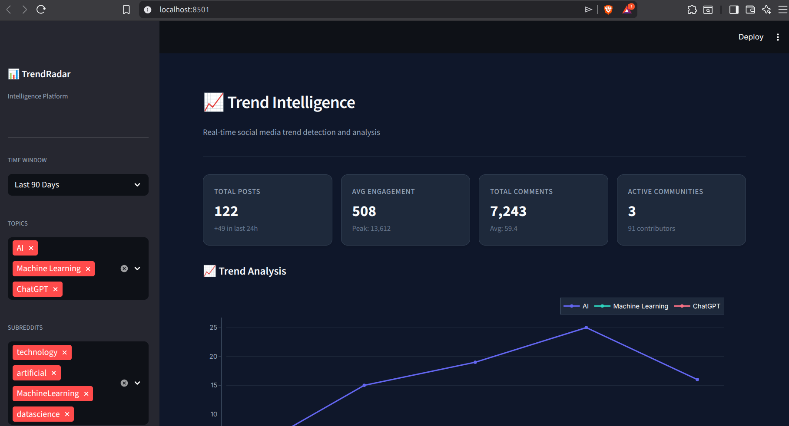
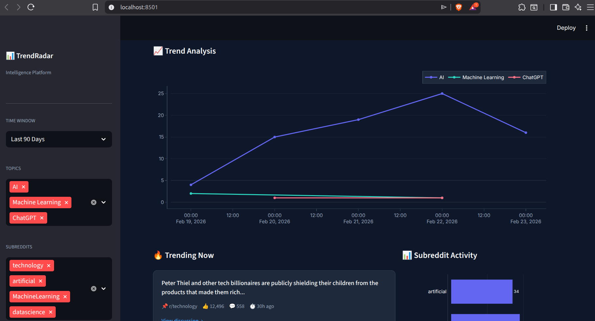
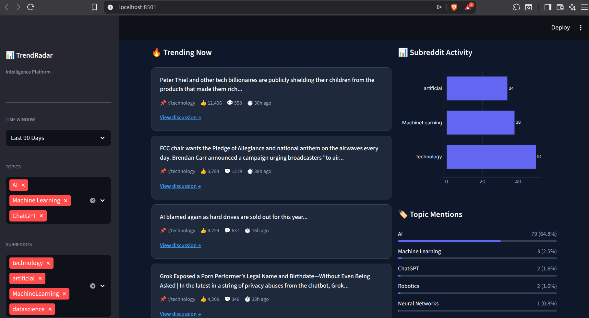
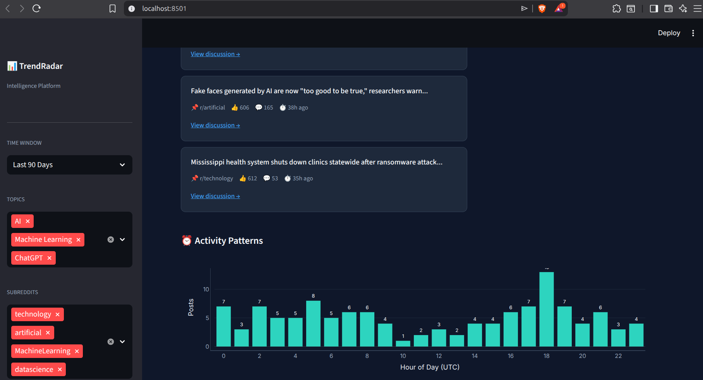

# TrendRadar

A real-time trend detection system that monitors Reddit discussions in technology and AI.



## Why I Built This

I wanted to understand how social media trends emerge and whether I could detect them programmatically. Most trend analysis tools are either expensive or black boxes. This project was my attempt to build a transparent, self-hosted alternative.

## Dashboard Views

### Trend Analysis

*Line charts showing topic mentions over time*

### Trending Posts

*Most engaging discussions with direct links*

### Activity Patterns

*Hourly posting patterns and subreddit distribution*

## How It Works

The system runs on my local machine, collecting data from Reddit every hour. It stores everything in MongoDB and visualizes patterns through a Streamlit dashboard.

**The data pipeline:**
1. Every hour, the collector fetches 25 latest posts from 8 subreddits
2. Each post's title, score, comments, and metadata are saved to MongoDB
3. The dashboard queries this database and calculates engagement metrics
4. Visualizations update in real-time as new data arrives

## Tech Stack

- **Python 3.11** - Core language
- **Streamlit** - Dashboard framework
- **MongoDB** - Data storage (runs in Docker)
- **Plotly** - Interactive charts
- **Pandas** - Data manipulation
- **Requests** - HTTP calls to Reddit's JSON endpoints

## Project Structure
trendradar/
├── collector/
│ └── reddit_collector.py # Fetches data from Reddit
├── database/
│ └── mongo_connector.py # Handles MongoDB operations
├── dashboard/
│ └── app.py # Main Streamlit application
├── images/
│ ├── dashboard.png
│ ├── dashboard1.png
│ ├── dashboard2.png
│ └── dashboard3.png
├── .env # Local environment variables
└── requirements.txt # Python dependencies

## Setup Instructions

### Prerequisites
- Python 3.11 or higher
- Docker
- Git

### Installation

```bash
# Clone the repository
git clone https://github.com/yourusername/trendradar.git
cd trendradar

# Set up Python environment
python3 -m venv venv
source venv/bin/activate

# Install dependencies
pip install -r requirements.txt

# Configure environment
echo "MONGO_URI=mongodb://localhost:27017/" > .env


Database Setup


# Start MongoDB container
docker run -d \
  --name mongodb \
  -p 27017:27017 \
  -v mongodb_data:/data/db \
  --restart always \
  mongo:latest

Running the Application

Terminal 1 - Data Collector (hourly job)

cd trendradar
source venv/bin/activate
python collector/reddit_collector.py

Terminal 2 - Dashboardh

cd trendradar
source venv/bin/activate
streamlit run dashboard/app.py

Then open http://localhost:8501


Key Features

    Automated Data Collection: Hourly scraping of 8 tech-focused subreddits

    Engagement Scoring: Each post scored based on votes and comments

    Topic Tracking: Monitors AI, ML, ChatGPT, Python and more

    Temporal Analysis: Identifies peak posting hours

    Subreddit Comparison: See which communities are most active

What I Learned

Building this taught me about building complete data pipelines from scratch. The collector needed proper error handling, the database required thoughtful indexing, and the dashboard had to balance information density with readability.

The simple engagement scoring algorithm (score + comments*3) proved surprisingly effective at surfacing substantive discussions rather than just popular posts.
License

MIT


Step 7: Check what files we have


git status


